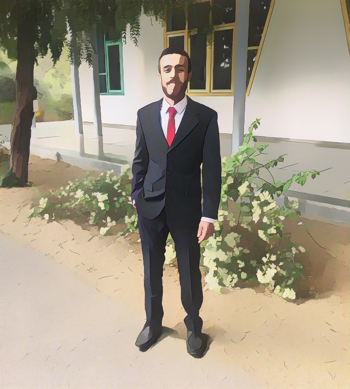

   

# Cartoonization Task using [CVPR2020] Learning to Cartoonize Using White-box Cartoon Representations [Original-Repo](https://github.com/SystemErrorWang/White-box-Cartoonization)

### Contents
- [Problem Definition](#Problem-Definition)
- [Thought Process](#Thought-Process)
- [Solution Approach](#Solution-Approach)
- [Data Handling](#Data-Handling)
- [Problem](#Problem)
- [Results](#Results)

## Problem Definition

Cartoon is a popular artistic form that has been widely applied in diverse scenes. Modern cartoon animation workflows allow artists to use a variety of sources to create contents. Our task is to build a model for an entertainment app in which users will provide pictures for you to apply an appropriate cartoon effect on given the variaty of cartoon effects that exist.

### Scenery

### Food

### Indoor Scenes

### People

## Thought Process

1. Searching for the problem definition on google.
2. Open paper with code website to search for the state of the art approach and choose the most recent and upvoted solution.
3. This work [CVPR2020] Learning to Cartoonize Using White-box Cartoon Representations is the most recent and the authors claims that they solve a lot of problems that have faced other researchers.
4. they did not mention the dataset in the readme file due to copyright issues, so I searched in the issues if some one have managed to get the dataset or to prepare it for faster replication and I found it. Note: The dataset is not hardly prepared and it can be easily regenerated, but it will take some time.
5. Downloading the pre-trained model
6. Pretrainig GANs
7. Train the whole model

## Solution Approach

### Intro

The problem is addressed using GANs. The authors tried to address the current problems in this task by introducing (1) three cartoon representations based on their observation of cartoon painting behavior: the surface representation, the structure representation, and the texture representation. where image processing modules are introduced to extract each representation. (2) A GAN-based image cartoonization framework which is optimized with the guide of extracted representations. (3) Extensive experiments  to show that their method can generate high-quality cartoonized images. 

Their method outperforms existing methods in qualitative comparison, quantitative comparison, and user preference.

### Related Work

You can find a list of related and previous work in the paper.

### Prerequisites

- Training code: Linux or Windows
- NVIDIA GPU + CUDA CuDNN for performance
- Inference code: Linux, Windows and MacOS
- create virtual env
- run `pip install -r requirements.txt`
- 

#### Installation

- Assume you already have NVIDIA GPU and CUDA CuDNN installed 
- create a new virtual env using venv
- Install tensorflow-gpu, we tested 1.12.0 and 1.13.0rc0 
- Install scikit-image==0.14.5, other versions may cause problems

### Network Architecture

Images are decomposed into the surface representation, the structure representation, and the texture representations, and three independent modules are introduced to extract corresponding representations. A GAN framework with a generator G and two discriminators Ds and Dt is proposed, where Ds aims to distinguish between surface representation extracted from model outputs and cartoons, and Dt is used to distinguish between texture representation extracted from outputs and cartoons. Pre-trained VGG network is used to extract high-level features and to impose spatial constrain on global contents between
extracted structure representations and outputs, and also between input photos and outputs. Weight for each component can be adjusted in the loss function, which allows users to control the output style and adapt the model to diverse use cases.

### Train

- Dowlaod the dataset from [link](https://drive.google.com/open?id=1JfJzJbNjAWBIHGm9mc_R9dXv7DAw3tZc)
- Place your training data in corresponding folders in /dataset 
- Run pretrain.py, results will be saved in /pretrain folder
- Run train.py, results will be saved in /train_cartoon folder
- Pretrained VGG_19 model can be found at following url:
https://drive.google.com/file/d/1j0jDENjdwxCDb36meP6-u5xDBzmKBOjJ/view?usp=sharing

# Results

### Inference 

#### Using pretrained model

- Store test images in /test_code/test_images
- Run /test_code/cartoonize.py
- Results will be saved in /test_code/cartoonized_images

before                                                                | after
--------------------------------------------------------------------- | ------------------------------------------
 | 
   |
 | 

#### Using my trained model
before                                                                | after
--------------------------------------------------------------------- | ------------------------------------------
 | 
   |
 | 

Note: due to limited resources and time, I pretrained Generator as the paper, but the whole model was trained for only 5K iterations

### further development

1. we can easily generate more data. 
2. we can try some sort of augmentation by rotation and adding noises.

## Evaluation

### Qualitative and user study evaluation

They compared their work qualitatively to previous methods and in the user study they asked humans to rate cartoon images from 1 to 5.

## Quantitative Evaluation  

They used Frechet Inception Distance (FID) which is wildly-used to quantitatively evaluate the quality of synthesized images. 
Pretrained Inception-V3 model  is used to extract high-level features of images and calculate the distance between two image distributions.

Also, a classifier is built on top of the discriminator to classify between real images and cartoon ones.

## Speed

They compared their network speed with previous realted work and the beat all of them.

